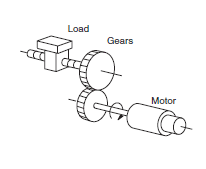

# Modern Robotics

## Chapter 9. Trajectory Generation, 궤적 생성

### 9.1 Definitions, 용어 정의

- 궤적
	- 경로 : ${\theta(s)}$, 로봇이 따라야 하는 기하학적 경로
	- 시간 스케일링 : ${s(t)}$, 로봇이 특정 경로를 따라 움직이는 시간적 정보를 정의

### 9.2 Point-to-Point Trajectories, 점대점 궤적

- 표현식 (Fig 9.1, p.345)
	- 경로 : ${\theta(s) : [0, 1] \rightarrow \mathbb{R}^n}$
		- 관절 공간 : ${\theta(s) = \theta_{start} + s(\theta_{end} - \theta_{start})}$
		- 태스크 공간 : ${X(s) = X_{start} + s(X_{end} - X_{start})}$
			- ${X(s) = X_{start}\exp{(\log{(X^-1_{start}X_{end})s})}}$
				- ${p(s) = p_{start} + s(p_{end} - p_{start})}$
				- ${R(s) = R_{start} \exp{(\log{(R^-1_{start}R_{end})s})}}$
	- 시간 스케일링 : ${s(t) : [0, T]}$
		- 속도 : ${\dot{\theta} = \displaystyle\frac{d\theta}{ds} \dot{s}}$
		- 가속도 : ${\ddot{\theta} = \displaystyle\frac{d\theta}{ds} \ddot{s} + \frac{d^2\theta}{ds^2} \dot{s}^2}$

- 시간 스케일링
	- 정적 : ${s(t) = \displaystyle\frac{t}{T}}$
	- 다항식 (Fig 9.3, p.347), (Fig 9.4, p.349)
		- 3차 : ${s(t) = a_0 + a_1t + a_2t^2 + a_3t^3}$
		- 5차 : ${s(t) = a_0 + a_1t + a_2t^2 + a_3t^3 + a_4t^4 + a_5t^5}$
	- 사다리꼴 (Fig 9.5, p.349)
		- 가속 : ${[0, t_a], \ddot{s}=a}$
		- 정속 : ${[t_a, T-t_a], \dot{s}=v, v = at_a}$
		- 감속 : ${[T-t_a, T], \ddot{s}=-a}$
	- S-커브 (Fig 9.6, p.351) : 사다리꼴에서 ${t=0, t=T}$ 일때, "가가속도"를 0으로 만들어줘야 한다.

> 단순히 경로만 고려하면 안된다.
> - 가속도 변화량(가가속도)에 따라 진동 발생 가능
> - 너무 느리면 비효율적

	

### 9.3 Polynomial Via Point Trajectories, 다항식 경유점 궤적

- 개요
	- 경로의 형태를 미리 지정하지 않고, *경유점*들을 정해진 시간에 지나게 하는 방법

- 경유점 정의
	- ${i \in {1 \dots k}}$ 에서 시작점 ${T_1 = 0}$, 종료점 ${T_k = T}$
		- 위치 : ${\beta(T_i) = \beta_i}$
		- 속도 : ${\dot{\beta}(T_i) = \dot{\beta}_i}$
	- 구간 지속 시간 : ${\Delta{T_j} = T_{j+1} - T_j}$
		- ${q(T_j + \Delta{t}) = a_{j0} + a_{j1}\Delta{t} + a_{j2}\Delta{t}^2 + a_{j3}\Delta{t}^3}$
		- 제약 조건 (식 9.26~9.29, p.353)

- 기타
	- 불연속적인 가속도 : 5차 다항식 사용
	- 경유점 시간-속도의 "합리적인" 조합을 휴리스틱한 방법으로 선택
	- B-spline 보간법 같은 방법도 존재.

### 9.4 Time-Optimal Time Scaling, 시간 최적의 시간 스케일링

- 개요
	- 경로를 따라 이동하는데 필요한 최소 시간을 찾는 문제

- ${(s, \dot{s})}$ 위상 평면 (Fig 9.10, p.357)
	- ${s}$ : 경로 상의 위치 매개변수, ${[0, 1]}$
	- ${\dot{s}}$ : 속도 (= 시간에 대한 위치 변화율)

- Motion Cone : 운동 원뿔 (Fig 9.11(a), p.358)
	- 가속도 제약 조건 적용 시, 위상 평면 상의 모든 곡선이 허용되는 것이 아님 = inadmissible
	- 운동 원뿔 내에서만 궤적을 유지할 수 있다.
		- 최대 허용 가속도 : ${U(s, \dot{s})}$
		- 최대 허용 감속도 : ${L(s, \dot{s})}$
	- ${\dot{s}_{lim}(s)}$ : 속도 제한 곡선 (Fig 9.11(b), p.358)
		- 이 곡선을 넘는 속도(= 곡선의 접선의 기울기를 넘는 가/감속도)는 불가능하다.

- 최적 시간 스케일링 문제
	- 최대 가속/감속을 유지하면서, 위상 평면에서의 속도 제한 곡선 높이를 최대화
	- 초기 상태 : ${(s_0, \dot{s}_0) = (0,0)}$
	- 최종 상태 : ${(s_f, \dot{s}_f) = (1,0)}$
	- 알고리즘
		1. 가속 구간 탐색
		2. 감속 구간 탐색
		3. 교차점 계산
		4. 이진 탐색 보정